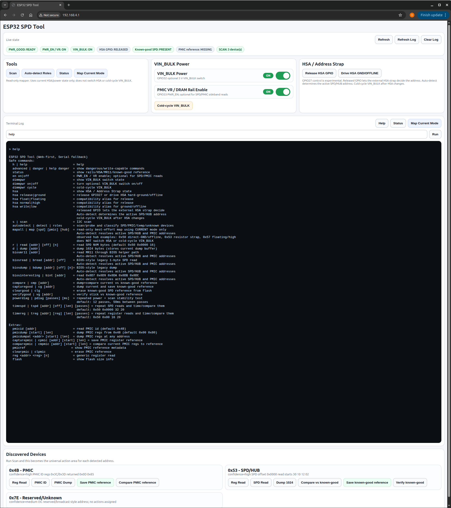
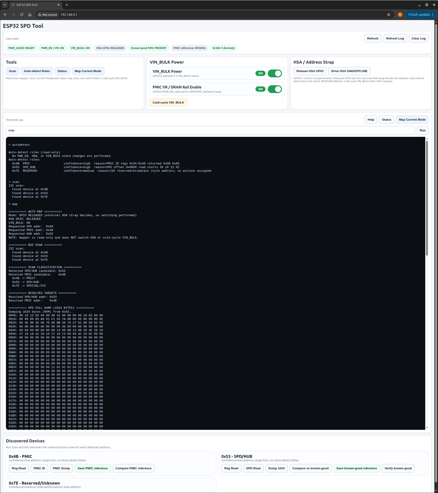

# DDR5 SPD Diagnostic Notes

A practical lab notebook for DDR5 UDIMM SPD hub, PMIC, sideband bus, and
ESP32-based recovery/debug tooling.

This repository collects the useful hard-won information from the DDR5
diagnostic project in one place:

- ESP32 harness wiring
- DDR5 UDIMM management pins
- SPD hub addressing behavior
- HSA strap behavior and address changes
- PMIC bring-up and status behavior
- Good-vs-bad module investigation notes
- Safe workflows for reading, dumping, comparing, and eventually writing
  SPD-related state

> [!WARNING]
> This repository documents a DIY, highly experimental DDR5 hardware/firmware lab project.
> It is not a polished repair guide, validated engineering design, or consumer-safe procedure.
>
> The work shown here involves custom wiring, improvised probing, live DDR5 module sideband access, PMIC/SPD investigation, ESP32 firmware, and boot-time bus sniffing. Incorrect wiring, voltage levels, power sequencing, write commands, or probing can permanently damage RAM modules, motherboards, ESP32 boards, USB ports, power supplies, or other attached equipment.
>
> If you choose to replicate anything in this repository, you do so entirely at your own risk. The author provides this material for documentation and educational purposes only and assumes no responsibility or liability for hardware damage, data loss, injury, or other consequences resulting from use, misuse, or attempted replication.

## Why this project exists

Bus Pirate 5+/6-class tools and dedicated DDR5 adapters provide a polished
paid-hardware path for DDR5 SPD work. This project explores a different route:
using inexpensive ESP32 boards, custom firmware, and documented DIY harnesses to
build a practical DDR5 SPD/PMIC diagnostic tool and passive boot-sideband
sniffer.

The goal is not to replace professional tools or dedicated analyzers. The goal
is to document a low-cost lab workflow for:

- reading and comparing DDR5 SPD data,
- inspecting SPD hub and PMIC behavior,
- recovering or validating corrupted SPD contents where appropriate,
- passively capturing motherboard boot-sideband traffic,
- comparing known-good and suspect module behavior.

One major advantage of the ESP32 approach is that the diagnostic interface does
not have to be tied to a full desktop setup. The active SPD/PMIC tool can be
used through a Wi-Fi Web UI / serial interface, and the passive boot sniffer can
be dumped through Bluetooth serial. That makes the project useful when working
with limited tools, cramped bench space, or a test system where moving cables or
power would erase a RAM-only capture.

A computer is still useful for firmware flashing, source changes, log analysis,
and repo work. The phone-friendly workflow is mainly for field/bench interaction
after firmware is already loaded.

## Tool paths

| Path | Interface | Best for |
|---|---|---|
| Active ESP32 SPD/PMIC tool | Wi-Fi Web UI and/or serial terminal | SPD dumps, comparison, recovery workflows, hub/PMIC register inspection |
| Passive ESP32 boot sniffer | Bluetooth serial and/or USB serial | Capturing motherboard-driven DDR5 boot sideband traffic |
| Dedicated tools / analyzers | Tool-specific UI/software | More polished workflows, deeper protocol analysis, or professional validation |

The active SPD/PMIC tool and passive boot sniffer are separate setups. Do not
mix their wiring assumptions.

## New reader path

- Start here: [`docs/universal/start-here.md`](docs/universal/start-here.md)
- Documentation index: [`docs/README.md`](docs/README.md)
- Hardware index: [`hardware/README.md`](hardware/README.md)
- Active SPD/PMIC tool docs: [`docs/spd-tool/`](docs/spd-tool/)
- Passive boot sniffer docs: [`docs/sniffer/`](docs/sniffer/)

## Web UI preview



The ESP32 firmware includes a browser-based Web UI over the ESP32 SoftAP, with
serial fallback for the same command surface. The UI exposes read-first
workflows, live power/state indicators, known-good SPD reference status, PMIC
reference status, and read-only role auto-detection.

### Auto-detect and current-mode mapping



Auto-detect classifies current bus devices by behavior instead of assuming fixed
addresses. In this harness, the active SPD/HUB address depends on the current
HSA GPIO state, external HSA strap condition, and full VIN_BULK cold-cycle
context.

## Current project state

The current diagnostic setup is centered around:

- ESP32 sideband access
- VIN_BULK power control or manual 5 V power cycling
- Manual HSA strap testing
- PWR_GOOD readiness checking
- Read/dump/compare-first diagnostic workflow

Current strongest finding: A known-good vs suspect boot sniffer comparison
suggests the suspect module is not simply absent from the SPD/PMIC sideband bus.
It reaches SPD/HUB traffic at `0x53` and PMIC traffic at `0x4B` before
diverging/stopping earlier than the known-good baseline. The current working
conclusion is likely DRAM-side / training-path failure, inferred from boot-time
sniffer divergence.

See
[`investigations/good-vs-bad-boot-sniffer-divergence.md`](investigations/good-vs-bad-boot-sniffer-divergence.md).

Post-repair suspect-module SPD/PMIC evidence logs are indexed here:
[`logs/examples/spd-tool/README.md`](logs/examples/spd-tool/README.md).

### Required / core signals

| Function | ESP32 GPIO | Status | Notes |
| --- | ---: | --- | --- |
| I2C SDA | 21 | Required | DDR5 sideband SDA. Direct 3.3 V lab wiring worked; PCA9306 level shifting remains the safer reference design. |
| I2C SCL | 22 | Required | DDR5 sideband SCL. Direct 3.3 V lab wiring worked; PCA9306 level shifting remains the safer reference design. |
| VIN_BULK control | 32 | Recommended convenience | Controls optional MOSFET high-side VIN_BULK switch. HIGH = DIMM off, LOW = DIMM on. Direct stable 5 V or a manual switch can also be used. |
| PWR_EN / VR enable | 33 | Optional | PMIC VR enable / DRAM rail enable. Not required for basic SPD/PMIC sideband access. |
| PWR_GOOD | 34 | Recommended readiness indicator | Useful readiness/wiring signal. If LOW, check harness/power/readiness before trusting bus results. |

### HSA strap testing

HSA was tested experimentally through ESP32 GPIO27, but the practical bench-test
method became **manual HSA strapping**.

| HSA method | Status | Notes |
| --- | --- | --- |
| Manual strap | Preferred for bench testing | Easier to reason about. Change strap, cold-cycle VIN_BULK, then scan/read. |
| ESP32 GPIO27 control | Optional experiment | Useful during testing, but not required for the basic harness workflow. |

Important HSA rule:

> HSA is sampled at power-up. Changing HSA requires a true DIMM VIN_BULK power
> cycle. Toggling PWR_EN alone is not enough.

Observed address behavior changed depending on HSA state at power-up:

| HSA mode | Practical wiring | Observed behavior in this project | Use |
|---|---|---|---|
| Direct hard-low / ground | HSA tied directly to ground | SPD/HUB observed at `0x50` | Direct-ground / hard-low / offline-style testing |
| Resistor-selected strap | HSA through the nominal 36.0 kΩ HSA/HID strap; measured ~34.4 kΩ in-circuit on this adapter/harness | SPD/HUB observed around `0x53` | Normal tested harness behavior |
| Floating/high | HSA released/floating/high | SPD/HUB observed around `0x57` | Experimental high/floating behavior |

The 36.0 kΩ value is the nominal/reference HSA/HID strap value from the SPD hub reference material tracked in `sources/source-index.md`. The ~34.4 kΩ value was measured in-circuit on this project's adapter/harness. Verify the actual strap resistance and address behavior on your own setup with `scan`, `autodetect`, and `mapall`.

## Key project corrections

- The technically conservative I2C wiring uses a PCA9306 or equivalent level
  shifter.
- The actual lab setup also worked with ESP32 3.3 V open-drain I2C connected
  directly to DIMM HSDA/HSCL.
- Direct 3.3 V sideband wiring is documented as a lab-proven shortcut for this
  setup, not a universal DDR5 rule.
- GPIO32 VIN_BULK switching is convenient, not mandatory. Direct stable 5 V or a
  manual switch can power VIN_BULK.
- PWR_EN should be treated as optional PMIC VR enable / DRAM rail enable, not SPD
  hub enable.
- PWR_GOOD LOW was observed as a wiring/readiness issue in this lab. Do not treat
  it as immediate proof of bad SPD/PMIC/DRAM.
- HSA behavior must be recorded with the strap condition and whether a full
  VIN_BULK cold reset was performed.
- MR12/MR13 mismatch is historical investigation context, not the current active
  root cause.
- Current strongest finding supports likely DRAM-side / training-path failure
  inferred from good-vs-bad motherboard boot sniffer divergence after SPD/HUB
  and PMIC sideband communication appeared functional.

## Repository layout

```text
docs/                  Main technical notes and workflows
hardware/              Harness wiring, pin references, CSV tables
firmware/              Prototype ESP32 diagnostic firmware
firmware-notes/        ESP32 command surface and behavior notes
investigations/        Good/bad stick findings and historical hypotheses
logs/                  Place future sanitized captures here; raw logs are ignored by default
assets/                Diagrams/photos/screenshots; raw bulky assets ignored by default
sources/               Source reference index; do not commit copyrighted PDFs by default
scripts/               Helper scripts for validation/export
```

## Firmware

The ESP32 diagnostic firmware source is included under:

[`firmware/esp32-spd-tool/`](firmware/esp32-spd-tool/)

It is prototype PlatformIO/Arduino firmware for the DDR5 SPD/PMIC diagnostic
tool. It provides the Web UI, serial fallback command interface, SPD/HUB
read/dump/compare workflows, PMIC ID/dump/reference workflows, read-only device
role auto-detection, VIN_BULK switch support, PWR_GOOD status reporting, and
experimental HSA GPIO release/ground control.

The documentation in this repo is the current interpretation of the lab setup
and DDR5 sideband behavior. The firmware is the working implementation used by
the tool, but it should still be treated as lab firmware rather than a polished
consumer repair product.

Advanced experimental workflows using the current SPD tool command surface are
documented in
[`docs/spd-tool/11-spd-tool-advanced-workflows.md`](docs/spd-tool/11-spd-tool-advanced-workflows.md).

## Documentation

- Documentation index: [`docs/README.md`](docs/README.md)
- Hardware index: [`hardware/README.md`](hardware/README.md)
- Active SPD/PMIC tool docs: [`docs/spd-tool/`](docs/spd-tool/)
- Passive boot sniffer docs: [`docs/sniffer/`](docs/sniffer/)
- Active SPD/PMIC harness wiring: [`hardware/spd-tool/harness-wiring.md`](hardware/spd-tool/harness-wiring.md)
- Passive boot sniffer wiring: [`hardware/sniffer/passive-boot-sniffer-wiring.md`](hardware/sniffer/passive-boot-sniffer-wiring.md)

## Boot sniffer

The repo includes a separate passive ESP32 boot sideband sniffer under:

[`firmware/esp32-boot-sniffer/`](firmware/esp32-boot-sniffer/)

It captures early DDR5 boot I2C / I2C-compatible sideband traffic into a compact
event buffer and dumps it after capture. It is useful for comparing known-good
and suspect module boot sequences.

The documented sniffer baseline was captured with an ESP32-WROOM-class board
using a RAM-only buffer; PSRAM/SD-card boards are optional upgrades, not
requirements.

- Boot sniffer usage/capture workflow: [`docs/sniffer/10-boot-sniffer.md`](docs/sniffer/10-boot-sniffer.md)
- Passive sniffer wiring: [`hardware/sniffer/passive-boot-sniffer-wiring.md`](hardware/sniffer/passive-boot-sniffer-wiring.md)

Example known-good baseline capture:

[`logs/examples/sniffer/good-stick-boot-0x53-baseline.txt`](logs/examples/sniffer/good-stick-boot-0x53-baseline.txt)

Suspect divergence capture:

[`logs/examples/sniffer/bad-stick-boot-divergence.txt`](logs/examples/sniffer/bad-stick-boot-divergence.txt)

The current comparison supports a likely DRAM-side / training-path failure
inference because the suspect module reaches SPD/HUB traffic at `0x53` and PMIC
traffic at `0x4B` before diverging/stopping earlier than the known-good
baseline.

This sniffer is not a full I3C analyzer.

## Start here

Read these first:

- `docs/universal/start-here.md`
- `docs/README.md`
- `hardware/README.md`
- `docs/universal/00-project-overview.md`
- `docs/universal/01-safety-boundaries.md`
- `hardware/spd-tool/harness-wiring.md`
- `docs/spd-tool/04-spd-hub-addressing.md`
- `investigations/good-vs-bad-boot-sniffer-divergence.md`
- `investigations/final-diagnosis-dram-failure.md`
- `investigations/good-vs-bad-stick.md`

## What is intentionally not included

The public repo should probably not include copied datasheet PDFs unless their
licenses clearly allow redistribution.

Keep PDFs locally and cite/link them in `sources/source-index.md`.

## Status

This is a lab documentation and prototype firmware repository for the DDR5
SPD/PMIC diagnostic setup. Treat the notes and firmware as active bench tooling,
not a finished consumer repair guide.
