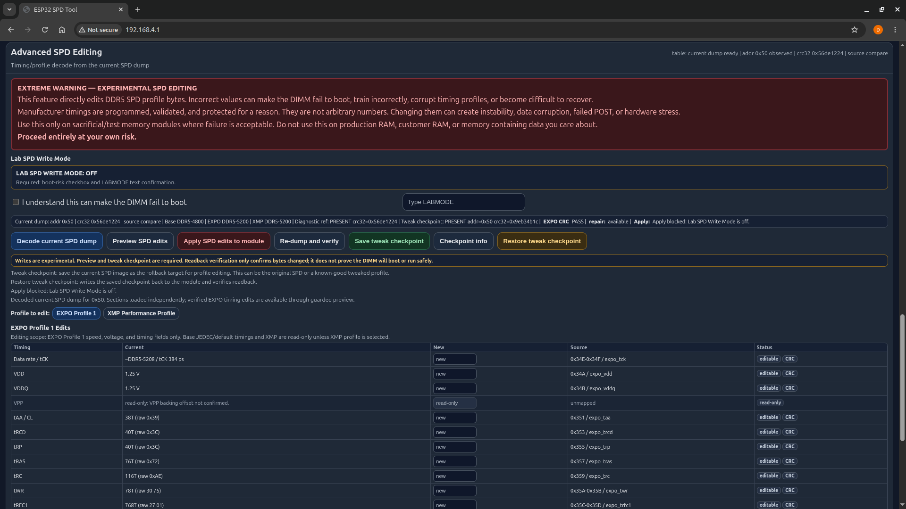

# DDR5 SPD Diagnostic Tooling

This project documents a DIY ESP32-based DDR5 SPD/PMIC diagnostic tool, a passive boot-sideband sniffer, and the evidence gathered while investigating a failed DDR5 UDIMM.

It helps you safely read DDR5 SPD data, inspect SPD hub and PMIC management-plane behavior, compare a module against a saved reference, and understand what the tool can and cannot prove.

It does **not** prove that a DIMM is electrically healthy, that DRAM cells are stable, that a memory controller will train the module, or that an SPD write made the stick bootable. The bad-stick repair case in this repo is management-plane evidence only: SPD payload restore/readback/compare/CRC/checksum, hub access, PMIC access, and bus-read stability can pass while the DIMM still fails to boot.

> [!WARNING]
> This is experimental lab hardware. Incorrect wiring, voltage rails, power sequencing, probing, or write commands can permanently damage DIMMs, ESP32 boards, motherboards, USB ports, power supplies, or other equipment. Start with read-only diagnostics. Treat all write-capable SPD operations as dangerous.

## Quick Navigation

| Start here | Link |
| --- | --- |
| First safe walkthrough | [Quick start](docs/quick-start.md) |
| Safety boundaries | [Safety](docs/safety.md) |
| Active ESP32 SPD tool wiring | [SPD tool wiring](docs/hardware/spd-tool-wiring.md) |
| Passive boot sniffer wiring | [Sniffer wiring](docs/hardware/sniffer-wiring.md) |
| References vs checkpoints | [Diagnostic reference vs tweak checkpoint](docs/reference-vs-checkpoint.md) |
| Experimental editing | [Advanced SPD editing](docs/advanced-spd-editing.md) |
| Common problems | [Troubleshooting](docs/troubleshooting.md) |
| Example captures and evidence | [Examples](docs/examples/README.md) |
| Existing deep docs | [Docs index](docs/README.md) |

## Overview

There are two related setups:

- Active ESP32 SPD/PMIC tool: reads and compares SPD, SPD hub, and PMIC state through a Web UI or serial command surface.
- Passive ESP32 boot sniffer: observes motherboard-driven DDR5 sideband traffic during boot to compare known-good and suspect behavior.

The active tool is best for careful read-only diagnostics. The sniffer is best for seeing what the motherboard attempts during boot.

## Who This Is For

This repo is for DIY electronics users, repair experimenters, firmware tinkerers, and hardware investigators who can work carefully with bench power, soldering, I2C, and logs.

You do not need to be a DDR5 vendor engineer to learn from it, but you do need to be honest about risk. A proper adapter PCB, good strain relief, verified rails, and read-only workflows are strongly recommended.

## What You Can Safely Do Read-Only

The safest useful workflow is:

- verify wiring and rails before inserting a DIMM,
- power the DIMM sideband/hub path through the planned harness,
- scan for devices,
- run auto-detect/current-mode mapping,
- dump SPD,
- inspect SPD hub and PMIC state,
- save comparison references,
- compare later captures against those references,
- run speed/stability tests as management-plane bus-read tests only.

Speed/stability tests in this project mean I2C/SPD/PMIC read repeatability. They do not test DRAM cells or memory-controller training.

## Hardware You Need

Typical active SPD tool hardware:

- ESP32 development board,
- DDR5 UDIMM extension/adapter or other safe breakout,
- verified 3.3 V and 5 V bench power as required by the harness,
- pull-ups or level shifting appropriate for your setup,
- optional VIN_BULK switching hardware,
- wires with strain relief,
- a multimeter, and preferably current-limited supplies.

Temporary piggyback soldering can work for lab captures, but it is not production-grade wiring. For repeated use, build or buy a proper adapter PCB.

## Wiring Overview

The active tool uses ESP32 I2C for DDR5 sideband access plus optional GPIOs for VIN_BULK, PWR_EN, PWR_GOOD, and HSA experiments. PWR_GOOD must be interpreted according to the declared hardware configuration, not as universal proof of DIMM health.

HSA deserves special care. GPIO runtime state may not be authoritative if the harness physically straps HSA. Direct-ground/offline-style `0x50` behavior and floating/high `0x57` behavior were observed in this harness and are historical/harness-dependent, not universal DDR5 truth.

See [SPD tool wiring](docs/hardware/spd-tool-wiring.md).

## Quick Start: Read-Only SPD/PMIC Diagnostics

1. Read [Safety](docs/safety.md).
2. Wire the active tool using [SPD tool wiring](docs/hardware/spd-tool-wiring.md).
3. Verify power rails before connecting a DIMM.
4. Boot the ESP32 firmware and open the Web UI.
5. Use read-only status, scan, auto-detect, map, SPD dump, PMIC inspect, and compare workflows first.
6. Save references only after you know what module/state they represent.

The firmware lives in [firmware/esp32-spd-tool](firmware/esp32-spd-tool).

## Understanding The Web UI

The Web UI is organized around hardware state, discovered devices, command output, references, and advanced tools. Normal users should stay in the read-only areas until they have a verified dump and understand their harness configuration.

Use the terminal/device output to confirm what the bus is actually doing before drawing conclusions.

## Diagnostic Reference Vs Tweak Checkpoint

Three saved states matter:

- Diagnostic SPD Reference: a known-good or original SPD payload used for comparison.
- Tweak Checkpoint: a rollback/checkpoint image for experimental profile edits.
- PMIC Reference: saved PMIC register state used for comparison.

They are not interchangeable. See [Diagnostic reference vs tweak checkpoint](docs/reference-vs-checkpoint.md).

## Example Workflows

Beginner-safe workflows:

- read and save an original SPD dump,
- compare a suspect module against a diagnostic SPD reference,
- compare PMIC register state against a PMIC reference,
- run read stability checks and treat them as bus-read evidence only.

Advanced workflows:

- restore a diagnostic reference to a corrupted SPD payload,
- compare hub protected/unprotected register snapshots as historical context,
- use boot sniffer captures to compare good and bad boot-sideband behavior.

See [Examples](docs/examples/README.md).

## Advanced/Experimental SPD Editing

Advanced SPD editing is experimental. The DDR5-5600 EXPO/XMP edit path has proven preview/write/readback/CRC behavior only. It has **not** proven BIOS/POST/memory stability.

CRC/checksum repair confirms bytes and checksums. Readback verification confirms what was written. Neither proves the DIMM will boot.

See [Advanced SPD editing](docs/advanced-spd-editing.md).

## Recovery/Restoring A Diagnostic Reference

Cloning/restoring a known-good SPD payload to the corrupt/bad DIMM is mostly proven at the management-plane level in the included evidence: readback, compare, CRC/checksum, hub access, PMIC access, and stability checks can pass.

Do not call that a confirmed DIMM repair. In the documented bad-stick case, the stick still does not boot/work. Current best conclusion: evidence points toward DRAM-side failure from boot-time/sniffer behavior, not an active SPD hub MR12/MR13 mismatch.

See [repair cases](docs/examples/repair-cases/README.md).

## Sniffer Notes

The passive sniffer is separate from the active SPD/PMIC tool. It observes boot-sideband traffic and helps compare a known-good module against a suspect one. Temporary piggyback wiring is fragile; use strain relief, verify reference grounds, and avoid loading the bus.

See [Sniffer wiring](docs/hardware/sniffer-wiring.md).

## Technical Docs And Examples

The beginner path is in the new focused docs above. Existing deeper notes remain available:

- [Universal docs](docs/universal/start-here.md)
- [SPD tool deep docs](docs/spd-tool/setup-guide.md)
- [Sniffer deep docs](docs/sniffer/10-boot-sniffer.md)
- [Examples and evidence](docs/examples/README.md)

No automatic commit or push is part of this workflow.
