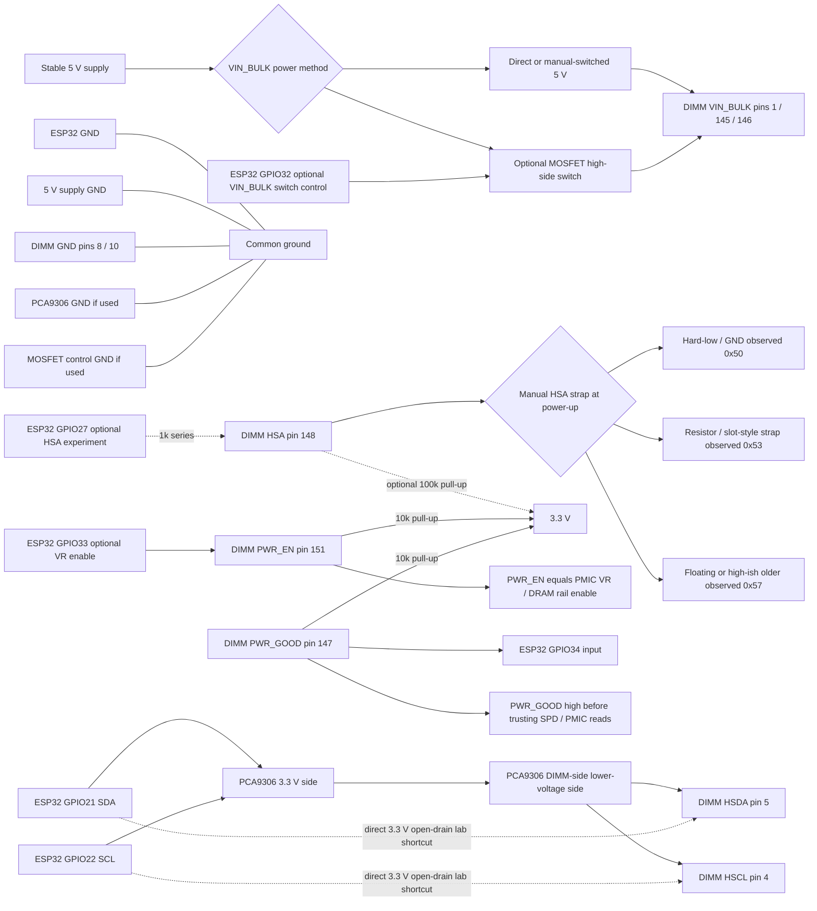
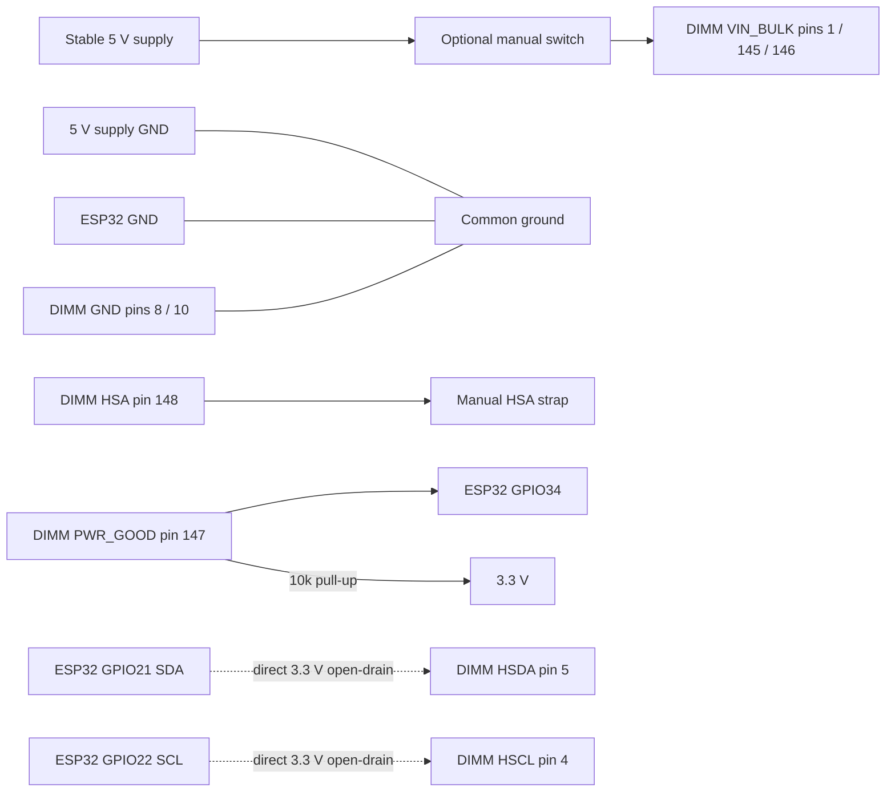
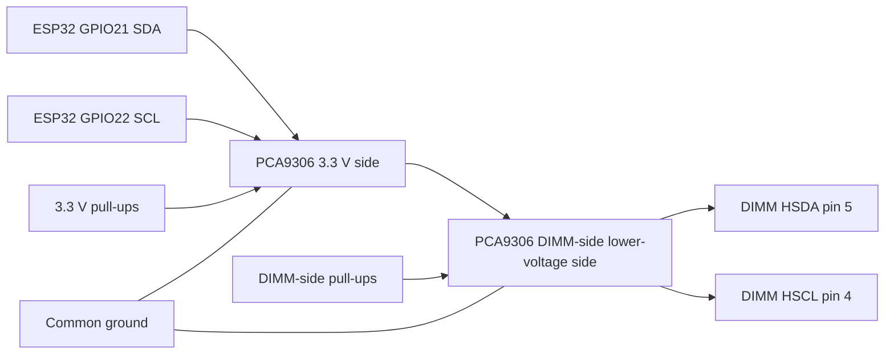

# Wiring Diagram

This diagram shows the current diagnostic harness model.

Key points:

- VIN_BULK can be powered through the optional ESP32-controlled MOSFET switch **or** directly/manual-switched from stable 5 V.
- HSA is preferably controlled by manual strap during bench testing.
- GPIO27 HSA control was only an optional experiment.
- PWR_EN is optional PMIC VR / DRAM rail enable, **not** SPD hub enable.
- PWR_GOOD is a readiness/wiring indicator.
- PCA9306 level shifting is the safer reference design, but direct ESP32 3.3 V open-drain I2C worked in the lab setup.

## Main harness diagram



## Power-cycle rule

After changing HSA strap state:

```text
Remove VIN_BULK
Set HSA strap
Restore VIN_BULK
Wait/check PWR_GOOD
Scan/read
```

That VIN_BULK cold cycle can be done by:

- GPIO32-controlled MOSFET switch
- Manual inline switch
- Bench supply output toggle
- Physically removing/restoring the 5 V feed

PWR_EN alone is not enough to force the SPD hub to re-sample HSA.

## Minimal direct/manual bench wiring



## Conservative level-shifted sideband wiring



## Short version

```text
VIN_BULK:
  stable 5 V direct/manual OR optional GPIO32 MOSFET switch

HSA:
  manual strap preferred
  GPIO27 optional experiment only
  full VIN_BULK cold-cycle required after change

PWR_EN:
  optional PMIC VR / DRAM rail enable
  not SPD hub enable

PWR_GOOD:
  readiness/wiring indicator
  LOW = check harness first

I2C:
  PCA9306 safer reference
  direct 3.3 V open-drain worked in this lab setup
```
