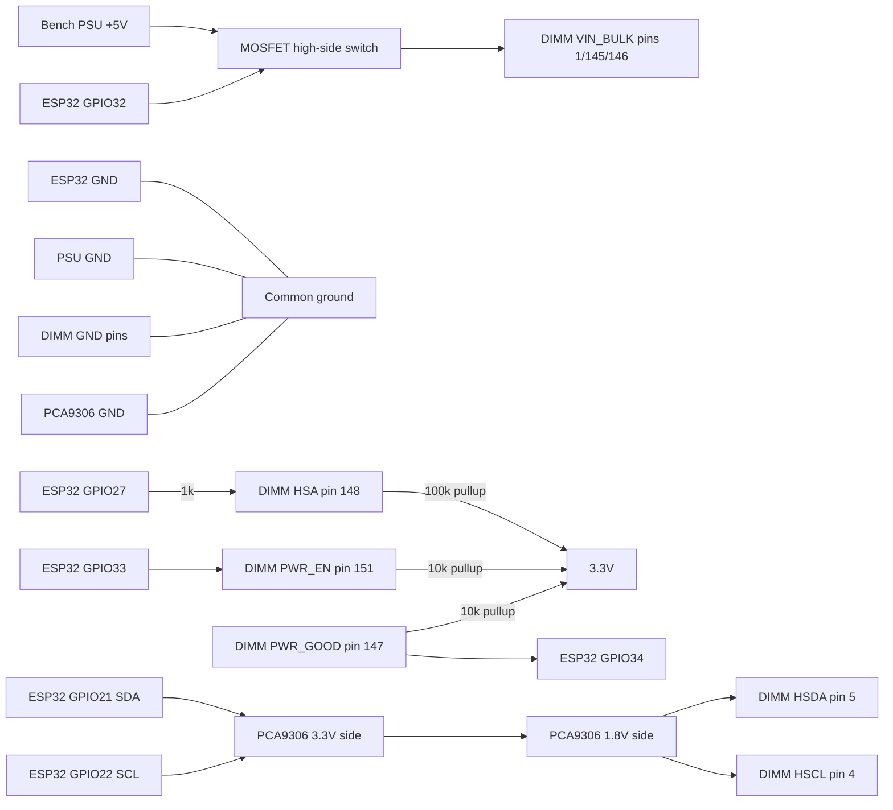

# Wiring Diagram

```mermaid
flowchart LR
    PSU5[Bench PSU +5V] --> MOSFET[MOSFET high-side switch]
    GPIO32[ESP32 GPIO32] --> MOSFET
    MOSFET --> VIN[DIMM VIN_BULK pins 1/145/146]

    ESP32GND[ESP32 GND] --- GND[Common ground]
    PSUGND[PSU GND] --- GND
    DIMMGND[DIMM GND pins] --- GND
    PCA[PCA9306 GND] --- GND

    GPIO27[ESP32 GPIO27] -- 1k --> HSA[DIMM HSA pin 148]
    HSA -- 100k pullup --> V33[3.3V]

    GPIO33[ESP32 GPIO33] --> PWREN[DIMM PWR_EN pin 151]
    PWREN -- 10k pullup --> V33

    PWRGOOD[DIMM PWR_GOOD pin 147] --> GPIO34[ESP32 GPIO34]
    PWRGOOD -- 10k pullup --> V33

    GPIO21[ESP32 GPIO21 SDA] --> PCA1[PCA9306 3.3V side]
    GPIO22[ESP32 GPIO22 SCL] --> PCA1
    PCA1 --> PCA2[PCA9306 1.8V side]
    PCA2 --> HSDA[DIMM HSDA pin 5]
    PCA2 --> HSCL[DIMM HSCL pin 4]
```
