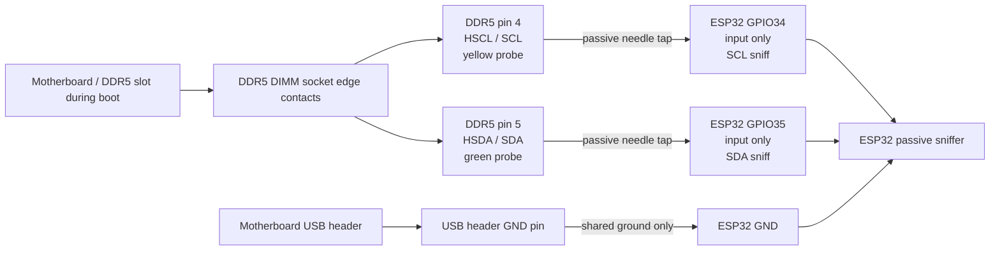

# Boot Sniffer

## Purpose

The boot sniffer is a passive ESP32 firmware image for capturing early DDR5 boot
sideband activity. It watches SCL/SDA and records compact decoded events during
the boot window, then dumps the retained capture after the window closes.

Firmware location:

[`firmware/esp32-boot-sniffer/`](../firmware/esp32-boot-sniffer/)

Known-good example baseline:

[`logs/examples/sniffer/good-stick-boot-0x53-baseline.txt`](../logs/examples/sniffer/good-stick-boot-0x53-baseline.txt)

The intended use is to compare known-good and suspect module boot sequences,
especially the point where the suspect module diverges from normal SPD/HUB or
PMIC sideband behavior.

## Electrical Rules

The sniffer must be passive. It must not drive SCL or SDA, and it must not become
an active bus participant.

Common ground is required between the sniffer and the system being observed.

If tapping true DDR5 low-voltage sideband lines directly, level shifting or
buffering is safer than direct ESP32 GPIO attachment.

## Passive DDR5 Boot Sniffer Wiring

| Connection | Wire color | Purpose | Notes |
|---|---:|---|---|
| DDR5 pin 4 / HSCL | Yellow | Sideband clock sniff | Passive tap only |
| DDR5 pin 5 / HSDA | Green | Sideband data sniff | Passive tap only |
| USB header GND -> ESP32 GND | Black | Shared reference ground | Do not use a DDR5 socket ground probe |

Notes:

- This is a passive boot sniffer, not an active programmer.
- The ESP32 must not drive HSCL or HSDA in this setup.
- Do not connect ESP32 3.3V or 5V to the motherboard/DIMM for this sniffer.
- Do not add pull-ups from the ESP32 side for this passive capture.
- GPIO34 and GPIO35 are input-only and are appropriate for passive sniffing.
- The yellow and green taps are soldered wire-to-pin-needle probes.
- The pin needles should be gently pressed into the socket contact area only
  enough to touch DDR5 pins 4 and 5.
- Do not deform the socket plastic or contacts.
- Ground is taken from a real motherboard USB header ground pin because it is
  mechanically safer and cleaner than trying to probe a DDR5 VSS contact.

Do not confuse this with the active ESP32 SPD/PMIC diagnostic harness. The
active harness may use ESP32 GPIO21/GPIO22 through level shifting for I2C
access. This passive boot sniffer uses GPIO34/GPIO35 as read-only sniff inputs
and relies on the motherboard as the bus master.

## Prototype pin-needle sniffer tap

During early bench testing, the sniffer used soldered pin needles as a removable
passive tap. Wires were soldered to pin needles, then the needles were inserted
into the DDR5 adapter/socket contact area for pins 4 and 5 to piggyback on HSCL
and HSDA.

These photos document the prototype bench method used for the captured examples.
They are not a complete wiring guide. Verify pin numbering, HSCL/HSDA mapping,
grounding, and voltage levels before connecting hardware. The sniffer must
remain passive and must not drive SCL/SDA.

<figure>
  
  <figcaption>Soldered pin needle used as removable sideband tap.</figcaption>
</figure>

<figure>
  
  <figcaption>Pin-needle taps inserted at DDR5 pins 4 and 5 for passive HSCL/HSDA sniffing.</figcaption>
</figure>

## Scope

This is a boot I2C / I2C-compatible sideband sniffer, not a full I3C analyzer.
It may observe useful early boot traffic, but normal ESP32 GPIO sampling should
not be treated as complete coverage for true I3C push-pull or high-speed phases.

Bigger ESP32 boards with PSRAM or SD storage can support longer retained
captures. Storage does not magically make an ESP32 a full I3C analyzer.

## Profiles

The current firmware profile family is:

- `WROOM_LOW_RAM`
- `PSRAM_BUFFERED`
- `SD_LOGGER`
- `USB_SERIAL_FAST`

`WROOM_LOW_RAM` captures a limited retained window. In the included known-good
baseline, `overflow=yes` means the 1024-event buffer filled; it does not mean the
boot failed.

## Current Baseline

`good-stick-boot-0x53-baseline.txt` is a good-stick boot baseline, not bad-stick
failure data. The dump metadata records:

- `profile=WROOM_LOW_RAM`
- `capture_scope=boot_i2c_compatible_sideband`
- `full_i3c_analyzer=false`
- `overflow=yes`
- `events=1024`

Active SPD/HUB traffic appears at `0x53` in the captured HSA/strap state.

## Good-vs-bad comparison

The sniffer is most useful when comparing a known-good baseline against a
suspect module under the same motherboard/slot/HSA/strap conditions.

Compared captures and investigation note:

- [`logs/examples/sniffer/good-stick-boot-0x53-baseline.txt`](../logs/examples/sniffer/good-stick-boot-0x53-baseline.txt)
- [`logs/examples/sniffer/bad-stick-boot-divergence.txt`](../logs/examples/sniffer/bad-stick-boot-divergence.txt)
- [`investigations/good-vs-bad-boot-sniffer-divergence.md`](../investigations/good-vs-bad-boot-sniffer-divergence.md)

The current comparison supports likely DRAM-side / training-path failure because
the suspect module reaches SPD/HUB and PMIC sideband traffic before
diverging/stopping earlier than the known-good baseline.
