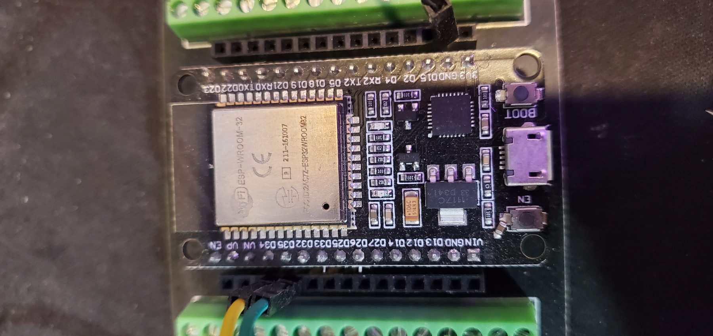
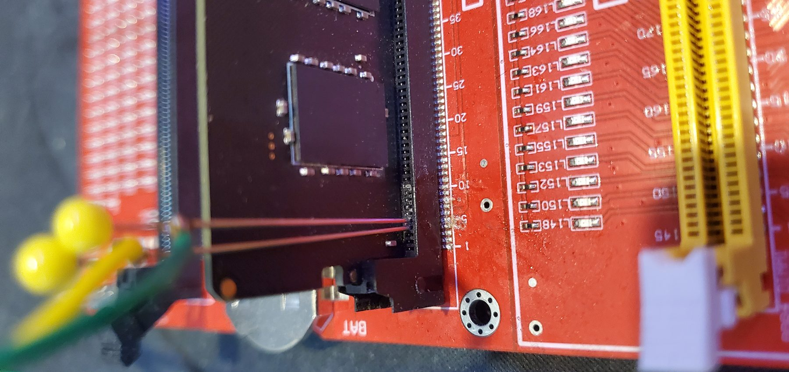
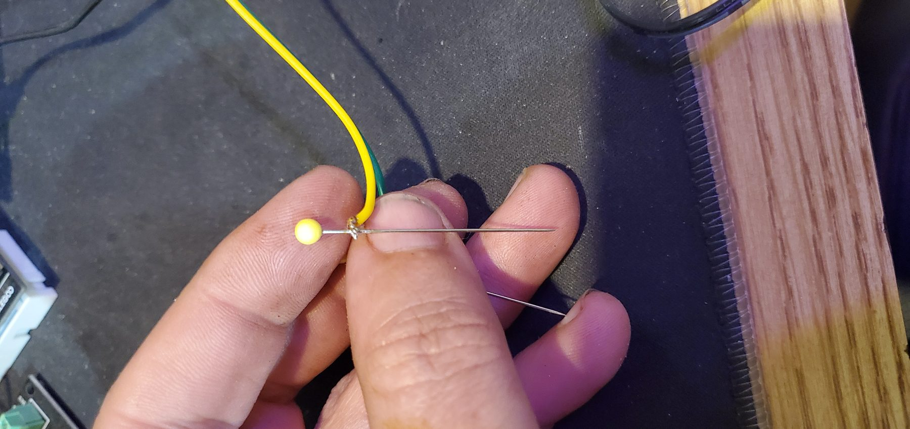

# Passive Boot Sniffer Wiring

[Back to README](../../README.md) | [Sniffer quick start](../sniffer/quick-start.md) | [Safety](../safety.md) | [Examples](../examples/README.md)

This is the piggyback/tap setup. It is separate from the active ESP32 SPD/PMIC tool.

The passive sniffer watches motherboard-driven DDR5 SDA/SCL behavior during boot. It must not drive the bus, power the DIMM, or add pull-ups.

## What It Is For

Use the sniffer to compare boot-time sideband behavior between a known-good DIMM and a suspect DIMM. It can show whether the motherboard reaches SPD hub and PMIC traffic before diverging.

It does not prove DRAM cell health by itself, and poor probe wiring can change the bus.

## Piggyback/Tap Wiring Notes

- Keep SDA/SCL pickup wiring short.
- Maintain a reliable ground reference.
- Add strain relief to probe wires and solder joints.
- Do not let the probe short adjacent pins.
- Do not force probes into the connector.
- Avoid loading the bus.
- Do not connect ESP32 3.3 V or 5 V to the motherboard/DIMM for this sniffer.

## Do Not Confuse It With The Active Tool

The active SPD tool uses a DDR5 extension adapter/breakout and talks directly to the DIMM SPD/PMIC management plane. The sniffer taps traffic that the motherboard is already generating during boot.

## Interpreting Captures

The current best conclusion from this project is that the bad stick reaches useful SPD/HUB and PMIC sideband activity, then diverges during boot. That evidence points toward DRAM-side/training-path failure, not an active SPD hub MR12/MR13 mismatch.
