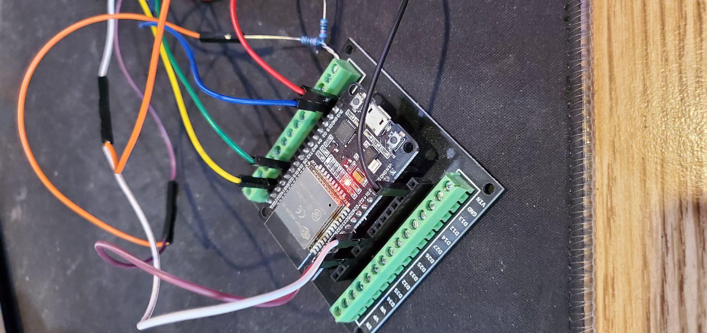

# Active ESP32 SPD Tool Wiring

[Back to README](../../README.md) | [Quick start](../quick-start.md) | [Safety](../safety.md)

The active tool uses an ESP32 to access the DDR5 SPD hub and PMIC management plane. These photos show prototype lab wiring examples, not production hardware.

## Typical Signals

| Function | ESP32 GPIO | Notes |
| --- | ---: | --- |
| SDA | 21 | DDR5 sideband SDA. Use appropriate pull-ups/level shifting for your harness. |
| SCL | 22 | DDR5 sideband SCL. Keep wiring short and stable. |
| VIN_BULK control | 32 | Optional switch control. Manual stable 5 V can also be used. |
| PWR_EN | 33 | PMIC enable input/control depending on harness. Do not leave required enables floating. |
| PWR_GOOD | 34 | Readiness signal only when wired/configured that way. |
| HSA experiment | 27 | Optional. Physical strap state may override what GPIO reports. |

## Power And Pull-Ups

Verify all rails before connecting a DIMM. A bench 3.3 V/5 V module can be convenient, but current limits, grounds, and output settings matter.

The example direct-wire setup used 10 k pull-ups for PWR_EN/PWR_GOOD behavior in that harness. Do not assume that value or topology is universal.

## HSA Address Behavior

Observed project behavior:

- direct-ground/offline-style HSA behavior could expose SPD/HUB around `0x50`,
- resistor/normal harness behavior was observed around `0x53`,
- floating/high behavior was observed around `0x57`.

This is harness/address behavior, not a universal DDR5 truth. Change HSA strap state only with a real VIN_BULK cold cycle, then scan again.

## Prototype Wiring Warnings

Temporary piggyback soldering and loose jumpers are not production-grade wiring. Use strain relief, verify voltage rails, and prefer a proper adapter PCB for repeated use. Wiring mistakes can damage DIMMs, ESP32 boards, motherboards, or power supplies.
