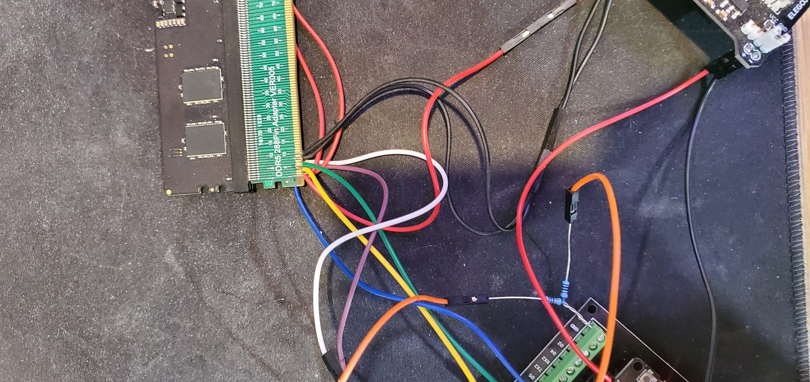
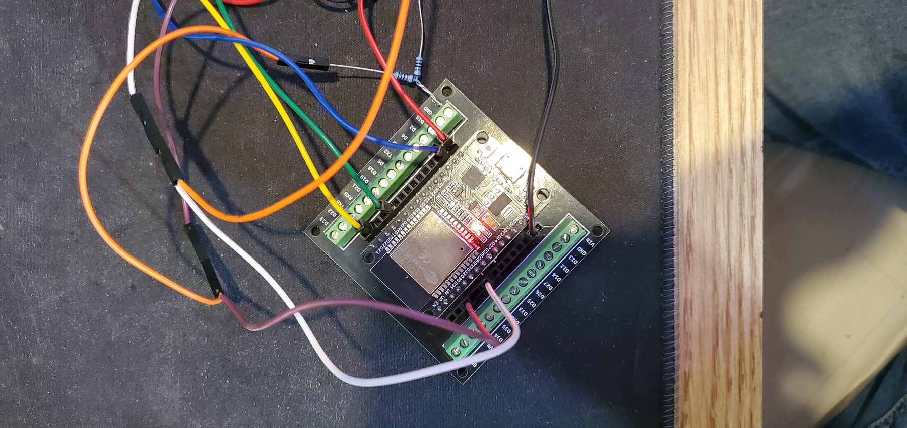
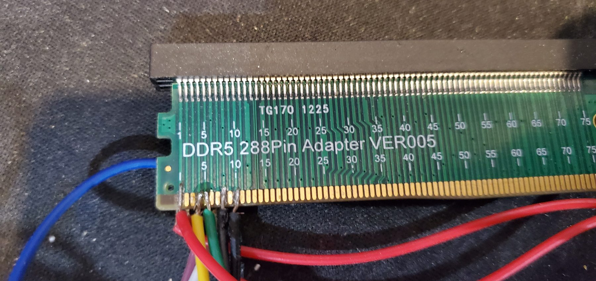
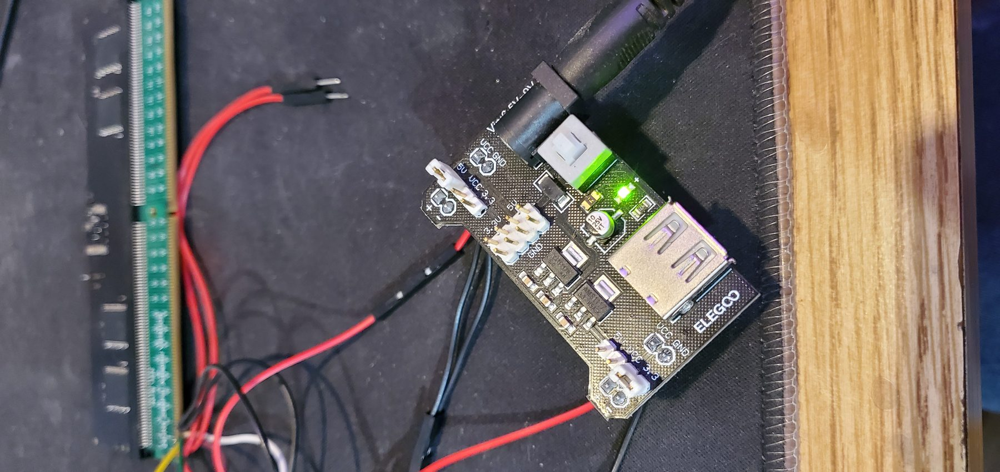

# Active ESP32 SPD Tool Wiring

[Back to README](../../README.md) | [Quick start](../quick-start.md) | [Safety](../safety.md)

This page describes the active ESP32 SPD/PMIC tool. It uses a DDR5 extension adapter or breakout and connects the ESP32 directly to the DIMM/adapter sideband pins. It is not a motherboard tap or sniffer harness.

## Minimum Proven Direct-Read Setup

This is the lab-proven minimum setup for this project:

| Signal | Connection |
| --- | --- |
| ESP32 GPIO21 | DIMM/adapter HSDA/SDA |
| ESP32 GPIO22 | DIMM/adapter HSCL/SCL |
| PWR_EN | 10 kOhm pull-up to 3.3 V |
| PWR_GOOD | 10 kOhm pull-up to 3.3 V, and ESP32 input if monitored |
| DIMM VIN_BULK | 5 V source to the DIMM VIN_BULK pins |
| ESP32 power | USB or another ESP32-safe power source |
| Ground | DIMM power ground and ESP32 ground must be shared |

The ESP32 internal SDA/SCL pull-ups worked for direct SPD/PMIC communication in this lab setup. No PCA9306 level shifter and no external SDA/SCL pull-ups were needed for this proven basic direct-read path.

## Practical Hardware List

- DDR5 extension adapter or breakout,
- ESP32 dev board,
- two 10 kOhm resistors for PWR_EN and PWR_GOOD,
- 5 V source for DIMM VIN_BULK,
- USB or other ESP32 power,
- shared ground between the ESP32 and DIMM supply,
- soldering iron and wire for the adapter pins.

## Power Notes

Verify rails before connecting a DIMM. The DIMM VIN_BULK supply and ESP32 must share ground or reads will fail. USB power for the ESP32 is fine as long as ground is shared with the DIMM supply.

PWR_EN and PWR_GOOD are pulled to 3.3 V through 10 kOhm resistors in the documented simple harness. PWR_GOOD is only meaningful if your hardware config and wiring actually monitor it.

## Optional/Alternate Wiring

Other harnesses may need extra help. External SDA/SCL pull-ups or level shifting can be useful troubleshooting or conservative-design options, but they are not part of the minimum proven direct-read setup described above.

A proper adapter PCB, cleaner protection, current limiting, and strain relief are better for repeated use.

## HSA Address Behavior

Observed project behavior:

- direct-ground/offline-style HSA behavior could expose SPD/HUB around `0x50`,
- resistor/normal harness behavior was observed around `0x53`,
- floating/high behavior was observed around `0x57`.

This is harness/address behavior, not a universal DDR5 truth. HSA is sampled during power-up, so change the physical HSA state, cold-cycle VIN_BULK, then scan again.

## Prototype Warning

The photos show prototype lab wiring. Loose jumpers and hand-soldered adapter wires should have strain relief. Wiring mistakes can damage DIMMs, ESP32 boards, motherboards, or power supplies.
