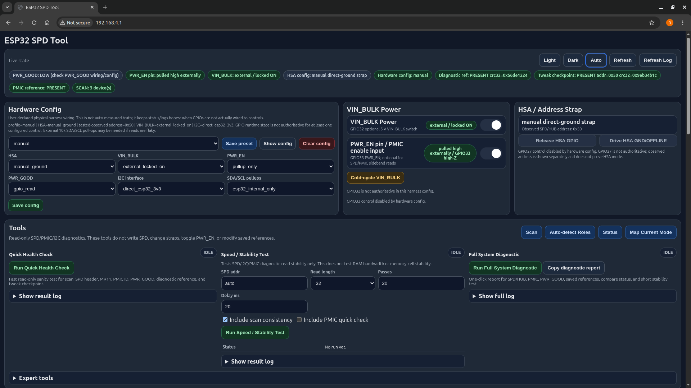
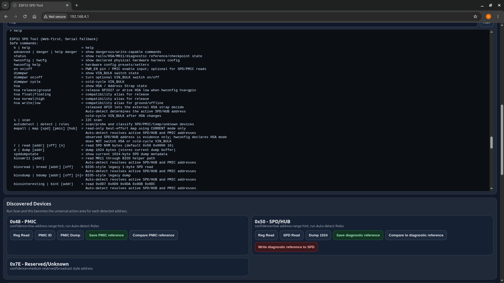

# Quick Start: ESP32 SPD Tool Read-Only Diagnostics

[Back to README](../README.md) | [Flashing](flashing.md) | [Safety](safety.md) | [SPD Tool wiring](hardware/spd-tool-wiring.md) | [Command reference](spd-tool/command-reference.md)

This is the beginner path for the active ESP32 SPD Tool. It starts with direct
adapter/breakout wiring and read-only diagnostics, not SPD editing.

## 1. Download The SPD Tool Firmware

Download the current prebuilt package:

- [esp32-spd-tool-v0.1.0.zip](https://github.com/djchumpguy/ddr5-spd-diagnostic/releases/download/v0.1.0/esp32-spd-tool-v0.1.0.zip)
- [Release page](https://github.com/djchumpguy/ddr5-spd-diagnostic/releases/tag/v0.1.0)

You do not need the whole repo just to flash and use the ESP32 SPD Tool. Clone the repo
only if you want the source, docs, examples, captures, or to build/modify firmware.

## 2. Flash The ESP32

Follow [Flashing](flashing.md). Flashing is separate from DDR5 wiring; do not connect or
probe DDR5 hardware just to flash the ESP32.

## 3. Wire The Active Adapter Harness

1. Use a DDR5 extension adapter or breakout.
2. Connect ESP32 GPIO21 to DIMM/adapter HSDA/SDA.
3. Connect ESP32 GPIO22 to DIMM/adapter HSCL/SCL.
4. Pull PWR_EN to 3.3 V with 10 kΩ. This pull-up is required; ESP32 GPIO33 control is optional.
5. Pull PWR_GOOD to 3.3 V with 10 kΩ and monitor it with ESP32 GPIO34. GPIO34 is input-only; PWR_GOOD is a readiness/wiring indicator, not an enable control.
6. Provide stable 5 V to the DIMM VIN_BULK pins.
7. Power the ESP32, USB is fine.
8. Share ground between the DIMM power supply and ESP32.

The proven basic direct-read setup did not need a PCA9306 level shifter or external
SDA/SCL pull-ups. Those can be troubleshooting or alternate-harness options later.

For the simple text version, see the
[minimum wiring diagram](hardware/spd-tool-wiring.md#minimum-wiring-diagram).

## 4. Check Before Power

- Read [Safety](safety.md).
- Verify 3.3 V, 5 V, PWR_EN, PWR_GOOD, and ground with a meter.
- Use strain relief on adapter wires.
- Confirm whether your harness physically straps HSA. The ESP32 GPIO runtime state may not describe the real HSA strap.



## 5. Open The Web UI

After the ESP32 boots, connect to the tool’s Wi-Fi/Web UI according to the firmware
package notes. The Web UI mirrors the serial command surface and is the easiest way to
start.

## 6. Run Read-Only Diagnostics

Use read-only commands first:

```text
status
scan
autodetect
health
dump
```

Useful next commands:

```text
mapall
diagquick
compare
verifygood
speedtest
fulldiag
```

Save a diagnostic SPD reference only when you are confident the dump is the
known-good/original payload. Capture a PMIC reference only when the PMIC state is
understood.

For command syntax, aliases, and safety classification, see the
[command reference](spd-tool/command-reference.md).



## What A Clean Read Means

A clean SPD dump, PMIC read, CRC/checksum, and repeated read stability are useful
management-plane evidence. They do not prove the DIMM will POST, train memory, or
survive a memory test.

For the documented bad stick, management-plane evidence became clean after restoring SPD
data, but the stick still did not boot. Boot-time sniffer behavior points toward
DRAM-side/training-path failure rather than an active SPD hub MR12/MR13 mismatch.

## Using The Passive Sniffer Instead?

The passive sniffer is a different firmware and a different harness. It taps
motherboard-driven SDA/SCL during boot and uses piggyback/tap wiring.

- [Download sniffer firmware](https://github.com/djchumpguy/ddr5-spd-diagnostic/releases/download/v0.1.0/esp32-ddr5-sniffer-v0.1.0.zip)
- [Sniffer quick start](sniffer/quick-start.md)
- [Sniffer wiring](hardware/sniffer-wiring.md)
