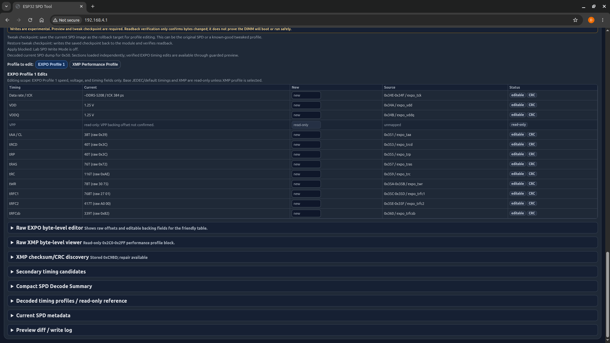

# Diagnostic Reference Vs Tweak Checkpoint

[Back to README](../README.md) | [Quick start](quick-start.md) | [Advanced SPD editing](advanced-spd-editing.md)

The firmware has several saved states. Use the right name so you do not restore the wrong thing.

## Diagnostic SPD Reference

A diagnostic SPD reference is a saved known-good or original SPD payload used for comparison and recovery workflows.

Use it for:

- comparing a suspect DIMM against a trusted dump,
- verifying a restored payload at the management-plane level,
- documenting original state.

Do not treat it as proof that the DIMM will boot.

## Tweak Checkpoint

A tweak checkpoint is a rollback/checkpoint image for experimental profile editing. It is not the same as the diagnostic reference.

Use it before advanced SPD editing so you can attempt a management-plane restore of the previous bytes.

## PMIC Reference

A PMIC reference is a saved PMIC register comparison target. It helps detect PMIC-side changes, but it is not a DRAM stability test.

## Verification Limits

Readback verification confirms the bytes that were read after writing. CRC/checksum repair confirms the payload math. Neither proves BIOS/POST/memory stability.
