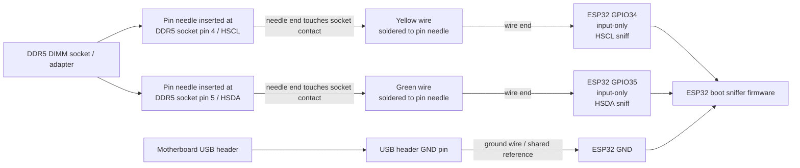

# Passive Boot Sniffer Wiring

This document describes the physical wiring for the passive ESP32 DDR5 boot
sniffer. This is separate from the active ESP32 SPD/PMIC diagnostic harness. The
passive sniffer observes motherboard-driven boot traffic and must not drive HSCL
or HSDA.

## Wiring truth

Yellow wire:

- One end is soldered to a pin needle.
- The needle end is gently inserted into the DDR5 socket/adapter contact for
  pin 4 / HSCL.
- The other wire end connects to ESP32 GPIO34.

Green wire:

- One end is soldered to a pin needle.
- The needle end is gently inserted into the DDR5 socket/adapter contact for
  pin 5 / HSDA.
- The other wire end connects to ESP32 GPIO35.

Ground wire:

- Motherboard USB header GND connects to ESP32 GND.
- Ground is not taken from the DDR5 socket.

| Probe assembly | Socket-side connection | ESP32-side connection | Purpose | Notes |
|---|---|---|---|---|
| Yellow wire soldered to pin needle | Needle inserted at DDR5 socket pin 4 / HSCL | GPIO34 | Sideband clock sniff | Passive input only |
| Green wire soldered to pin needle | Needle inserted at DDR5 socket pin 5 / HSDA | GPIO35 | Sideband data sniff | Passive input only |
| Ground wire | Motherboard USB header GND | ESP32 GND | Shared reference ground | Do not use a DDR5 socket ground probe |

> [!CAUTION]
> This is a passive sniffer harness only. The ESP32 must not drive HSCL or HSDA.
> Do not connect ESP32 3.3V or 5V to the motherboard/DIMM for this sniffer.
> Do not add ESP32-side pull-ups for this passive capture.
> The pin needles are socket-side probe tips only. Press them gently into the DDR5 socket/adapter contact area just enough to touch pins 4 and 5. Do not deform the socket housing or contacts.

## Prototype probe photos

These photos show the prototype wire-to-pin-needle tap method used during bench
testing. They are included as physical context for the schematic above. Use the
schematic and wiring table as the source of truth; the photos only show the
prototype implementation.

<figure>
  
  <figcaption>Soldered wire-to-pin-needle probe used as the removable socket-side tap.</figcaption>
</figure>

<figure>
  
  <figcaption>Pin-needle probes gently inserted at DDR5 socket pins 4 and 5 to piggyback HSCL/HSDA.</figcaption>
</figure>

> [!NOTE]
> The needle tips are only meant to touch the socket contacts lightly. They should not be forced into the connector or used in a way that bends/deforms the socket housing or contacts.

## Do not confuse this with the active SPD/PMIC harness

| Harness | ESP32 pins | Connection style | Bus master | Purpose |
|---|---|---|---|---|
| Active SPD/PMIC diagnostic harness | GPIO21/GPIO22 plus control/status pins | Level-shifted controlled bus access | ESP32 | SPD/PMIC reads, dumps, and controlled writes |
| Passive boot sniffer harness | GPIO34/GPIO35 plus shared GND | Read-only pin-needle taps | Motherboard | Observe boot traffic |

GPIO34 is reused differently between the two projects. In the active SPD/PMIC
harness it is used for PWR_GOOD. In the passive boot sniffer harness it is used
as the HSCL sniff input. Do not combine these wiring assumptions without
changing firmware and hardware deliberately.
