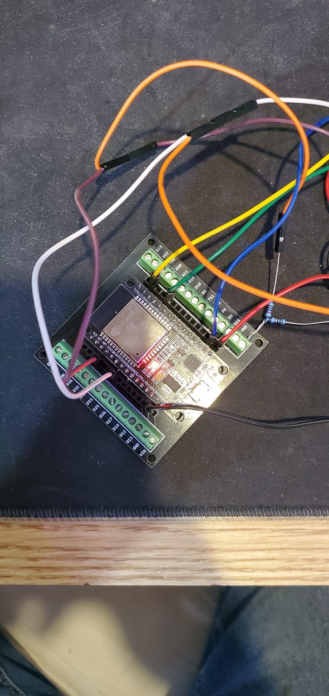
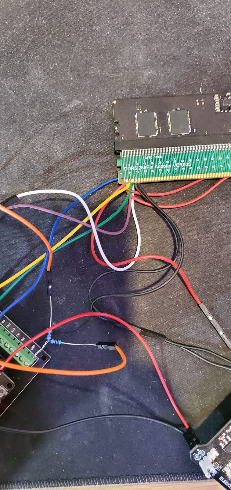
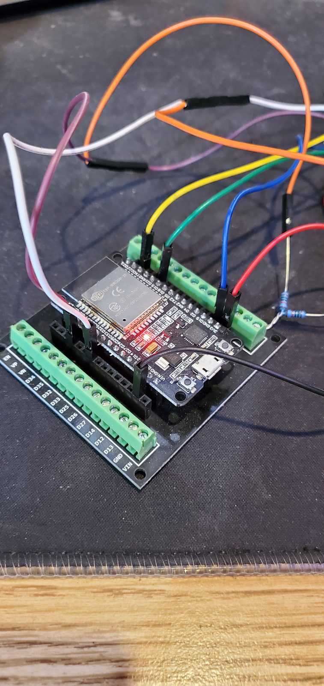
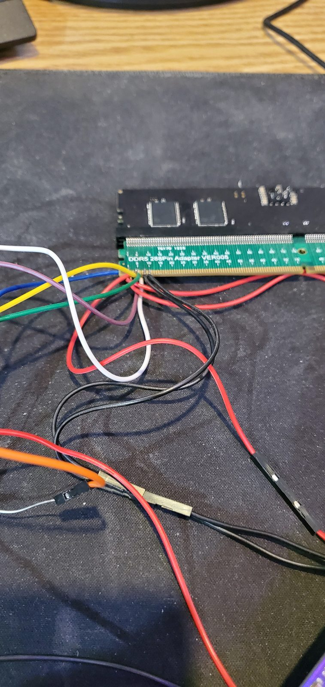
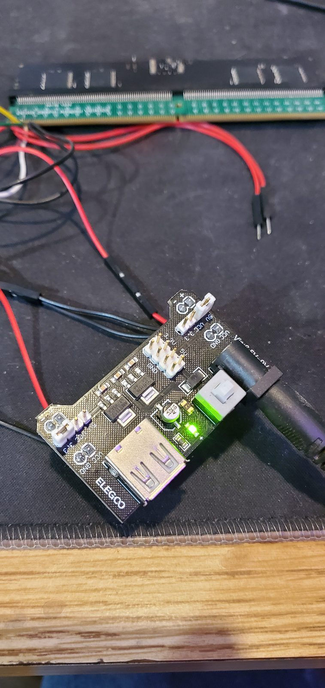
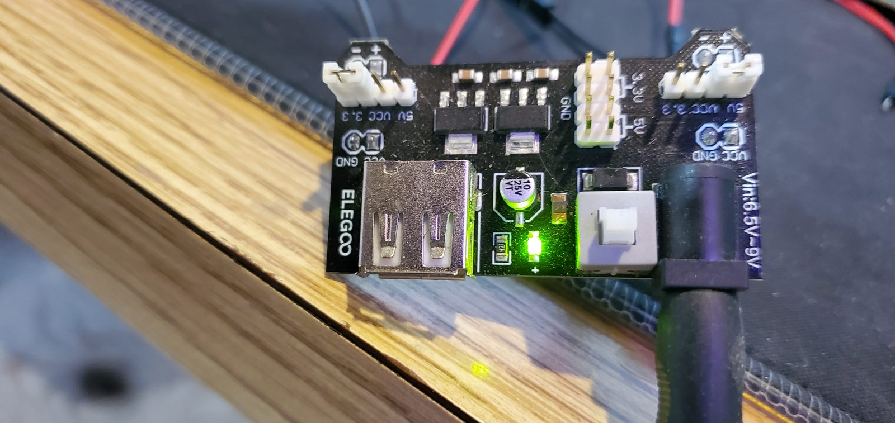

# Experimental Minimum Direct-Wire Read Setup

## Purpose

This document describes the experimental bare-minimum ESP32 DDR5 SPD/PMIC read
setup.

This minimum direct-wire setup was used to reproduce stable SPD hub and PMIC
reads with fewer parts than the full validated harness.

It is not the recommended final hardware implementation.

The recommended long-term hardware target remains a dedicated ESP32 DDR5
diagnostic board with an onboard DDR5 socket, protected DIMM power switching,
proper bus-interface circuitry, HSA control, PWR_EN/PWR_GOOD handling, status
LEDs, and labeled test points.

## What This Setup Proves

The minimum direct-wire setup successfully read the DDR5 SPD hub and PMIC
sideband devices without using the PCA9306 level shifter.

Validated read-only results:

- `scan`: found `0x48`, `0x50`, and `0x7E`
- `0x48`: PMIC
- `0x50`: SPD_HUB
- `0x7E`: reserved / I3C-style address
- `powerdiag`: PASS, PWR_GOOD ready 12/12, scanCount stable at 3 devices
- `timespd 0x50 0x0000 32 100`: PASS, 100/100 successful, 0 mismatches
- `timereg 0x50 0x00 16 100`: PASS, 100/100 successful, 0 mismatches
- `timereg 0x48 0x00 16 100`: PASS, 100/100 successful, 0 mismatches

This validates the setup for experimental read-only SPD hub and PMIC access.

It does not yet validate safe write/recovery behavior.

## Parts Used

The tested minimum setup used:

- ESP32 WROOM-class development board
- ESP32 screw-terminal / breadboard-style adapter
- DDR5 extension adapter for solder access
- breadboard power supply module
- jumper wiring
- 10k pull-up resistors for PWR_EN and PWR_GOOD
- no PCA9306 level shifter
- no external SDA/SCL pull-ups in the successful test

The DDR5 extension adapter was used so the harness wires could be soldered to
accessible adapter pads instead of soldering directly to a DDR5 DIMM.

## Wiring Summary

| Function | DDR5 pin | ESP32 / supply connection | Notes |
| --- | ---: | --- | --- |
| VIN_BULK 5 V | `1` | breadboard supply 5 V | minimum test used pin 1 |
| GND | `8` | common ground | ESP32 and DIMM grounds must be shared |
| HSCL | `4` | ESP32 GPIO22 / SCL | direct wire, no PCA9306 |
| HSDA | `5` | ESP32 GPIO21 / SDA | direct wire, no PCA9306 |
| HSA | `148` | GND | direct-ground / hard-low / offline-style `0x50` behavior |
| PWR_EN | `151` | ESP32 GPIO33 plus 10k pull-up to 3.3 V | must be pulled/enabled |
| PWR_GOOD | `147` | ESP32 GPIO34 plus 10k pull-up to 3.3 V | diagnostic/readback |

## Pull-Up Requirements

For this minimum setup, PWR_EN must be pulled high/enabled.

```text
3.3 V -- 10k -- DDR5 pin 151 / PWR_EN
```

PWR_EN readback/control through ESP32 GPIO33 is optional, but the PWR_EN line
itself must not float.

PWR_GOOD is optional for pure reads, but if connected to the ESP32 it should be
pulled up:

```text
3.3 V -- 10k -- DDR5 pin 147 / PWR_GOOD
```

The successful test did not use external SDA/SCL pull-ups. The ESP32
internal/open-drain I2C behavior was sufficient for this specific setup at
100 kHz.

If reads are flaky, add external pull-ups:

```text
3.3 V -- 10k -- DDR5 pin 4 / HSCL
3.3 V -- 10k -- DDR5 pin 5 / HSDA
```

## HSA Behavior

This setup tied HSA directly to ground.

That produces the observed `0x50` direct-ground / hard-low / offline-style
behavior.

Do not describe `0x50` as generic write mode.

| Observed address | HSA condition | Meaning |
| --- | --- | --- |
| `0x50` | HSA tied directly to GND | direct-ground / hard-low / offline-style behavior |
| `0x53` | ~36k class resistor strap to GND | normal resistor-selected strap behavior |
| `0x57` | HSA floating or pulled high experimentally | floating/high experimental behavior |

## Safe First Commands

Use read-only commands first:

```text
scan
autodetect
powerdiag
timespd 0x50 0x0000 32 100
timereg 0x50 0x00 16 100
timereg 0x48 0x00 16 100
```

Do not run write/recovery tests until repeated reads are stable.

## Photo Notes

The photos in
[`../../assets/minimum-direct-wire-setup/`](../../assets/minimum-direct-wire-setup/)
show the actual minimum direct-wire bench setup.

They are included as prototype evidence, not as polished build instructions.

The wiring is functional but fragile. A dedicated PCB or HAT remains the
preferred long-term implementation.

| Photo | Notes |
| --- | --- |
|  | ESP32 WROOM-class board on the screw-terminal adapter with direct sideband wiring. |
|  | DDR5 extension adapter and jumper routing used for solder access. |
|  | ESP32-side PWR_EN/PWR_GOOD pull-up wiring area. |
|  | Wire entry and solder-access area on the DDR5 extension adapter. |
|  | Breadboard power supply module feeding DIMM VIN_BULK. |
|  | Close-up of the breadboard power module used in the minimum setup. |
